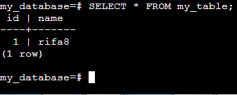

# Play with Docker
A simple, interactive and fun playground to learn Docker.

TIPS:
- copy: ctrl + Ins
- paste: shift + Ins

# In this Repo
- Run Postgres
- Run CloudBeaver
- Insert data

# Prerequirement
- Docker Hub account
- init.sql

# Steps
**1. Create Instance**
    
Go to [PWD](https://labs.play-with-docker.com/), login and start. Add new instance to create an instance.

**2. Run Postgres**

First, pull postgres image:
```
docker pull postgres
```

Then, run Postgres container:
```
docker run -d --name my_postgres_container -p 5432:5432 -e POSTGRES_PASSWORD=pass123 postgres
```

**3. Create Database and Table**

Interact with executing container:
```
docker exec -it my_postgres_container bash
```

Establish a connection with database server:
```
psql -h localhost -U postgres
```

To show database:
```
\l
```
Press `Q` to exit.

Create new database:
```
CREATE DATABASE my_database;
```

Interact with the new database:

`exit` or `\q`.
```
psql -U postgres -d my_database
```


Create new table:
```
CREATE TABLE my_table(id INT, name TEXT);
```

Try to insert data:
```
INSERT INTO my_table(id, name) VALUES (1, 'rifa8');
```

Show the data:
```
SELECT * FROM my_table;
```


**4. Run CloudBeaver**

Exit from Postgres container and pull CloudBeaver image.
```
docker pull dbeaver/cloudbeaver
```


We can add new instance and connect it using ssh. Copy and paste ssh into the new instance. Type `yes` to continue connecting.


Run CloudBeaver:
```
docker run --name cloudbeaver --rm -ti -p 8080:8978 -v /var/cloudbeaver/workspace:/opt/cloudbeaver/workspace dbeaver/cloudbeaver:latest
```


Back to the previous instance and open port `8080` to access CloudBeaver.


If the port didn't appear, click open port and type `8080` manually.


Set session lifetime and administrator credentials.

Finish and login.

**5. Set Postgres Connection**

Back to app, set new connection and choose Postgres


Copy IP of the first instance and paste into host. Set port, database, username and password.


Create connection after the connection is established.


Check the table we created before.


**6. Execute init.sql**

Open SQL editor in CloudBeaver to execute the queries. We can upload sql script or just copy and paste all the queries.


Block or select all queries to execute them at once. And press ctrl + enter for the shortcut.

Check the data.


**7. Finish**

Thank you.

